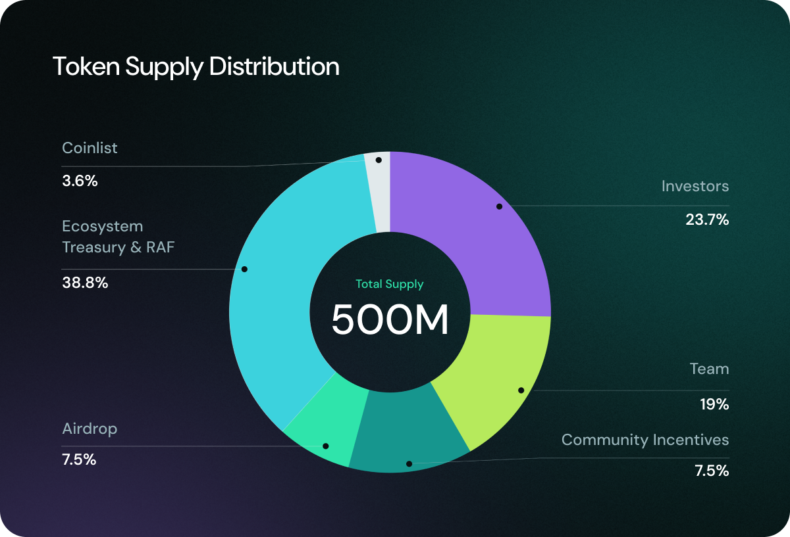
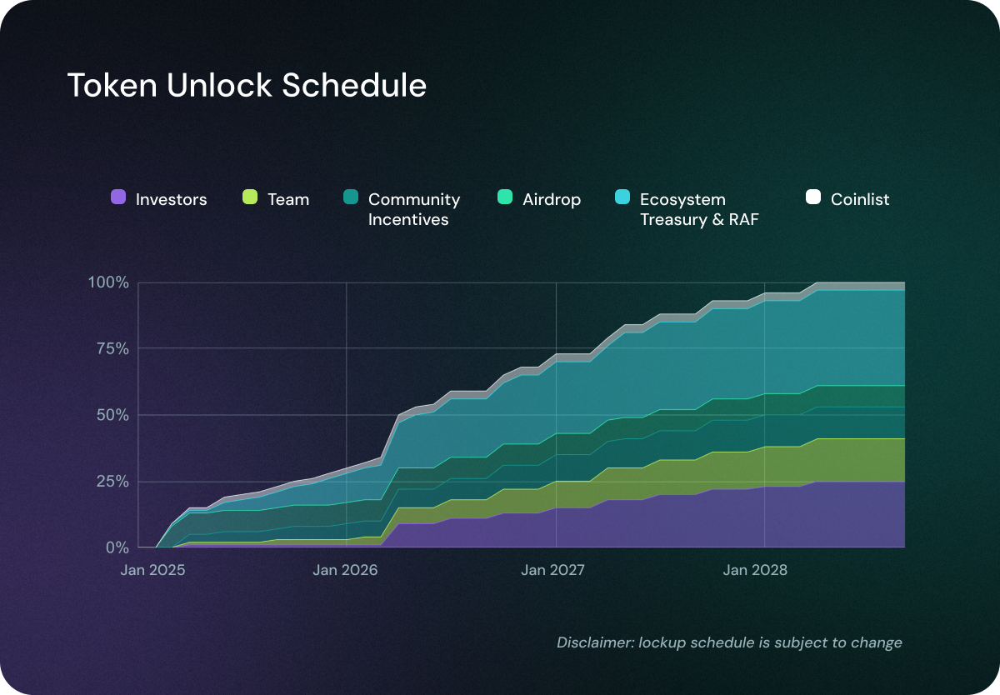

# The OBOL Token

The OBOL Token is central to the governance and operation of the Obol Collective. It serves multiple purposes that are essential to its functioning.

**OBOL Token Transferability:** With the approval of[ OIP-2](https://community.obol.org/t/oip-2-unlock-obol-token/317/30), the OBOL Token is set for a strategic and well-planned unlock. The tokens will be unlocked when the Obol Association determines the optimal timing, following the completion of centralized exchange listings. This thoughtful approach ensures a sustainable launch, supporting ecosystem growth, decentralization, and long-term value for the community.

## Token Utility

### **Governance**

OBOL Token holders delegate their voting power to delegates who participate in the Token House decision-making processes. This includes voting on proposals affecting the Obol Collective’s direction, upgrades, and funding allocations. Read more about the Token House [here](token-house.md).

### **Obol Retroactive Funding (RAF)**

Token holders delegate their voting power to Delegates, who vote on the projects eligible for retroactive funding. Read more about the Obol RAF [here](raf.md).

### **OBOL Token Staking**

As per[ OIP-1](https://community.obol.org/t/oip-1-building-and-enabling-staking-for-the-obol-token/312), OBOL token holders will have the opportunity to stake their tokens, contributing to the security and stability of the Collective by preserving governance while earning rewards and being able to engage in DeFi. Staking involves depositing OBOL tokens in a vault (without lockup) that automatically delegates the Tokens if not done already. In return, stakers receive stOBOL, which automatically accrues OBOL Tokens as rewards as it's price vs OBOL increases.&#x20;

This staking program will be implemented in phases, allowing the community to gradually engage in and benefit from the system while reinforcing the decentralization of the Obol Collective. For the first six months, the total rewards will be 0.33% of the total supply, providing early participants with attractive rewards. After this period, the staking rewards may be adjusted based on governance proposals and market conditions. This structured rollout ensures a sustainable and rewarding staking experience while reinforcing the decentralization of the Obol Collective.&#x20;

### **DeFi**

Plans are in place to launch several DeFi avenues for the OBOL Token post-TGE, such as liquidity pools, lending protocols (e.g. Morpho) and restaking (e.g. Eigenlayer, Symbiotic).

### **More Utility Coming Soon**

Via Token House governance proposals in the [Governance Forum](https://community.obol.org/), the Obol community can add more functionality and utility to the OBOL Token.

## Token Contract

The official token contract address of the OBOL Token is [0x0B010000b7624eb9B3DfBC279673C76E9D29D5F7](https://etherscan.io/address/0x0B010000b7624eb9B3DfBC279673C76E9D29D5F7).

## Token Distribution

The total supply is capped at 500 million tokens. The full supply is not immediately circulating and tokens will unlock over the coming months and years.

<figure><figcaption></figcaption></figure>

### **Ecosystem Treasury & Retroactive Funding (RAF)**

A significant portion of OBOL Tokens are allocated to the ecosystem treasury to drive innovation and growth. These funds support different initiatives, for example, [**SQUAD Goals**](https://community.obol.org/t/oip-3-obol-collective-2025-goals-proposal/)**, Grants & Partnerships** who help the growth of the protocol and the broader Collective.&#x20;

This portion of Tokens is also used for strategic parnterships with centralised exchanges and providing sufficient liquidity for the OBOL Token via Market Makers.

It also covers [**Retroactive Funding (RAF)**](https://docs.obol.org/community-and-governance/governance/raf)**,** rewarding contributions that have positively impacted the Obol Collective. Over time, the Obol Association plans to give additional control over these tokens to the community.

### **Investors**

Early investors played a key role in bringing the Obol Collective to life. This allocation ensures that individuals and entities that provided early financial support are fairly rewarded while adhering to best practices in responsible token vesting.

### **Team**

To attract and retain top-tier talent, a portion of tokens is reserved for core contributors, founders, and developers. This allocation aligns with the long-term vision of the project and is subject to a lock-up period similar to the one of investors.

### **Community Incentives**

To promote awareness and adoption, OBOL tokens will be used for user-focused initiatives that drive adoption of Obol DVs. The first of these initiative is the [Obol Incentives Program.](https://obol.org/incentives)

### **Airdrop**

As a community-first initiative, Obol has rewarded early contributors and supporters through a retroactive airdrop. This ensures ongoing participation in the Collective and strengthens the decentralized operator ecosystem. For more information about the Airdrop distribution, please [see this blog article](https://blog.obol.org/airdrop/).

### **Public Sale via Coinlist**

To ensure broad and fair token distribution, a portion of OBOL Tokens have been made available through a [Coinlist public sale](https://coinlist.co/obol) at better terms than investors. 50% of tokens purchased in the token sale will be fully unlocked and transferable at TGE, followed by a 12 month linear unlock for the remainder of the tokens.

## Token Liquidity

Once the token becomes transferable, the community will be able to track the distribution schedule and observe how the circulating supply increases over time according to the structured unlock plan.

<figure><figcaption></figcaption></figure>
