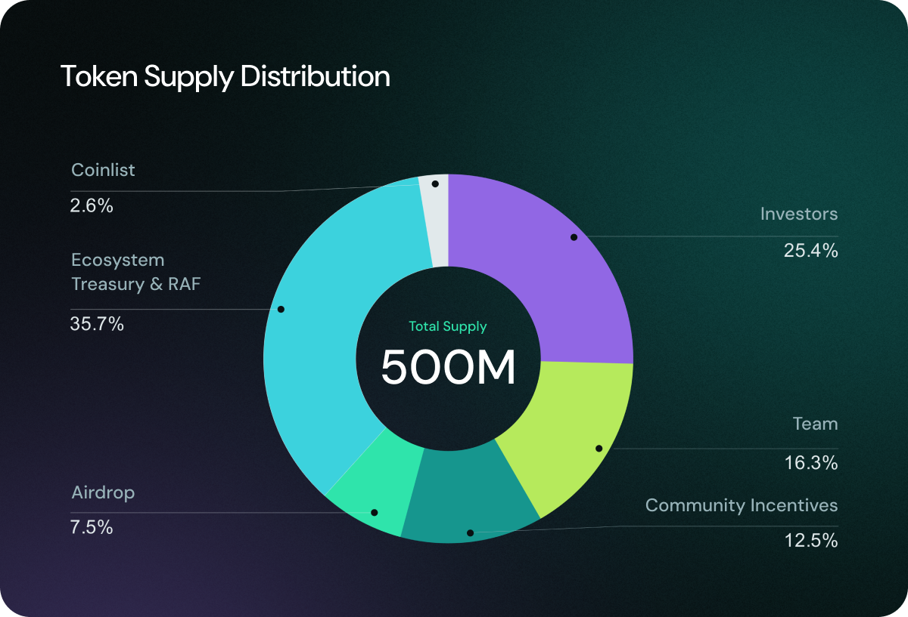

# The OBOL Token

The OBOL Token is central to the governance and operation of the Obol Collective. It serves multiple purposes that are essential to its functioning.

### Token Contract

The official token contract address of the OBOL Token is [0x0B010000b7624eb9B3DfBC279673C76E9D29D5F7](https://etherscan.io/address/0x0B010000b7624eb9B3DfBC279673C76E9D29D5F7).

### Token Supply

The total supply is capped at 500 million tokens. The full supply is not immediately circulating and tokens will unlock over the coming months and years. Please see the [airdrop announcement](http://blog.obol.org/airdrop/) for more details.

<figure><figcaption></figcaption></figure>

<figure><figcaption></figcaption></figure>

### Token Utility

1. **Token Governance:** OBOL Token holders delegate their voting power to delegates who participate in the Token House decision-making processes. This includes voting on proposals affecting the Obol Collective’s direction, upgrades, and funding allocations. Read more about the Token House [here](token-house.md).
2. **Obol Retroactive Funding (RAF):** Token holders delegate their voting power to Delegates, who vote on the projects eligible for retroactive funding. Read more about the Obol RAF [here](raf.md).
3. **DeFi:** Plans are in place to launch several DeFi avenues for the OBOL Token post-TGE, such as liquidity pools and lending protocols.
4. **OBOL Token Staking:** As per[ OIP-1](https://community.obol.org/t/oip-1-building-and-enabling-staking-for-the-obol-token/312), OBOL token holders will have the opportunity to stake their tokens, contributing to the security and stability of the network while earning rewards. Staking involves locking up OBOL tokens in a protocol to support its operations, such as securing the network or participating in governance. In return, stakers receive OBOL Tokens as rewards. This staking program will be implemented in phases, allowing the community to gradually engage in and benefit from the system while reinforcing the decentralization of the Obol ecosystem. The staking program will be implemented in phases, with the first phase expected to launch by TGE. For the first six months, the total rewards will be 0.33% of the total supply, providing early participants with attractive rewards. After this period, the staking rewards may be adjusted based on governance proposals and network conditions. This structured rollout ensures a sustainable and rewarding staking experience while reinforcing the decentralization of the Obol ecosystem. By March, 20th, Tally will Complete audit and share documentation of the Liquid Staking Token contracts. The product implementation will be live by the Unlock OBOL Token event.
5. **OBOL Token Transferability:** With the approval of[ OIP-2](https://community.obol.org/t/oip-2-unlock-obol-token/317/30), the OBOL Token is set for a strategic and well-planned release. The tokens, currently secured in a smart contract, will be unlocked when the Obol Association determines the optimal timing, following the completion of centralized exchange listings. This thoughtful approach ensures a sustainable launch, supporting ecosystem growth, decentralization, and long-term value for the community.
6. **More Utility Coming Soon:** Via governance proposals in the [Governance Forum](https://community.obol.org/), the Obol community can add more functionality to the OBOL Token.
