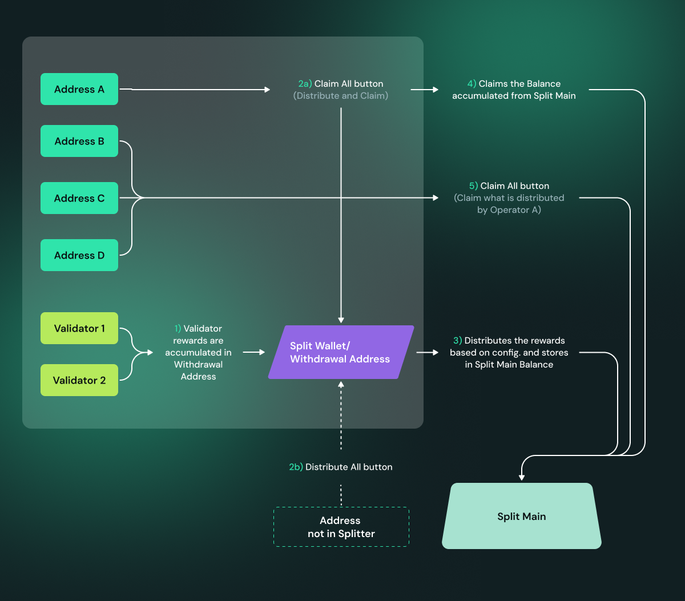

# Exit a DV

### Introduction[​](https://docs.obol.org/next/run/running/quickstart-exit#introduction) <a href="#introduction" id="introduction"></a>

Users looking to exit staking entirely and withdraw their full balance back must sign and broadcast a "voluntary exit" message with validator keys which will start the process of exiting from staking. In the case of a DV, Charon nodes need to broadcast a partial exit to the other nodes of the cluster. Once a threshold of partial exits has been received by any node, the full voluntary exit will be sent to the beacon chain. This process will take 27 hours or longer depending on the current length of the exit queue. Once the validator is exited, the principal plus unclaimed rewards will go to the withdrawal address of the validator. Depending on the cluster's withdrawal configuration, users can claim their proporiton of principal and rewards.

There are two ways to sign the partial exit and broadcast the full exit. Both the solutions don't require gas.

1. **Using the Charon’s exit solution** - It is an Obol hosted solution which is facilitated by Obol APIs. It provides several benefits such as signing partial exits for multiple validators at once, live monitoring of partial exits status via launchpad and ability to download partial exits and broadcast them later as required. Users don’t have to worry about the intricacies of validator clients. Charon Exit abstracts all the complexity.
2. **Using the Validator Clients directly** - Users can also directly use the validator client that is connected to your Charon client to submit partial exits, as the client only signs a partial exit message using its share of the private key. Charon will combine the partial exit messages from the other operators. Once the threshold is reached, they are submitted to the beacon node. All of this is usually wrapped under a single command and hence users cannot download full exit signatures for broadcasting it later. In this case, users cannot use launchpad to monitor exit status and will have to use grafana to query the partial exit status.


* A threshold of operators need to run the exit command for the exit to succeed. This is the same threshold as is specified during cluster creation.
* **Ensure that all operators within a cluster consistently use either the hosted solution (Charon Exit) or the non-hosted solution (Validator Client Exit). Mixing both solutions within the same cluster—where some operators use Charon Exit while others use Validator Client Exit—is not allowed.**
* In case of validator client native exits, partial exits can be broadcast by any validator client as long as the threshold for the cluster is reached.
* If a Charon client restarts after the exit command is run but before the threshold is reached, it will lose the partial exits it has received from the other nodes. If all Charon clients restart and thus all partial exits are lost before the required threshold of exit messages are received, operators will have to rebroadcast their partial exit messages.
* All operators need to use the same `EXIT_EPOCH` for the exit to be successful. Assuming you want to exit as soon as possible, the default epochs included in the below commands should be sufficient for the respective network.


As per your preferences, choose the correct combination of -

1. **Network** : Mainnet or Holesky
2. **Exit Type** : Hosted (Charon) or Non-hosted (Validator client)
3. **Validator Quanity**: Exit single or Exit all validators:&#x20;





Voluntary exit can be submitted directly through Charon. This approach is validator client agnostic as Charon abstracts validator client's native exit commands underneath.

### Step 1: Submit partial exit <a href="#introduction" id="introduction"></a>



Following command signs a partial exit for a specific validator pubkey.

```sh
docker exec -it charon-distributed-validator-node-charon-1 /bin/sh -c 'charon exit sign \
--beacon-node-endpoints="http://lighthouse:5052" \
--validator-public-key="<VALIDATOR_PUBLIC_KEY>" \
--exit-epoch=256'
```

Replace `<VALIDATOR_PUBLIC_KEY>` with the validator's full pubkey (as visible in Ethereum).



Following command signs partial exits for all validators.

```sh
docker exec -it charon-distributed-validator-node-charon-1 /bin/sh -c 'charon exit sign \
--beacon-node-endpoints="http://lighthouse:5052" \
--all \
--exit-epoch=256'
```



**Step 2: Monitor the Partial Exits' status**

After a threshold of signed partial exits from node operators in the cluster is accumulated, a full (complete) exit can be created. For example, in the cluster below, only 2 out of 4 clusters have reached the threshold. Operators will have to wait for one more partial exit signature, either from operator 1 or 3 to create a full exit message.\


<figure><figcaption></figcaption></figure>

**Step 3: Broadcast the full exit**

Once the partial exit threshold is reached, a full exit can be broadcasted from any of the operator. There are two options to do it, depending on your use-case

1. **Fetch the full exit and broadcast instantaneously (Broadcast directly )** - users can choose it for a single validator or all validators in the cluster.
2. **Fetch the full exit and broadcast it later(Fetch & Broadcast later )** - users can choose it for a single validator or all validators in the cluster.





Following command fetches full exit and broadcasts it instantaneously for a specific validator.

```sh
docker exec -it charon-distributed-validator-node-charon-1 /bin/sh -c 'charon exit broadcast \
--beacon-node-endpoints="http://lighthouse:5052" \
--validator-public-key="<VALIDATOR_PUBLIC_KEY>"'
```


Once a validator has broadcasted an exit message, it must continue to validate for at least 27 hours or longer. Do not shut off your distributed validator nodes until your validator is fully exited.




Following command fetches full exits and broadcasts them instantaneously for all the validators that have reached a partial exit threshold.

```sh
docker exec -it charon-distributed-validator-node-charon-1 /bin/sh -c 'charon exit broadcast \
--beacon-node-endpoints="http://lighthouse:5052" \
--all'
```


Once a validator has broadcasted an exit message, it must continue to validate for at least 27 hours or longer. Do not shut off your distributed validator nodes until your validator is fully exited.








**Download Exits** : The following command downloads the full exit signature for a specific public key and stores it in a file.

```
docker exec -it charon-distributed-validator-node-charon-1 /bin/sh -c 'charon exit fetch \
--validator-public-key="<VALIDATOR_PUBLIC_KEY>" \
--fetched-exit-path="/opt/charon/.charon"'
```

**Broadcast Exits** : The following command uses the full exit signature for a specific public key from the file and broadcasts it to the network.

```
docker exec -it charon-distributed-validator-node-charon-1 /bin/sh -c 'charon exit broadcast \
--beacon-node-endpoints="http://lighthouse:5052" \
--exit-from-file="/opt/charon/.charon/<FILENAME>"''
```


Once a validator has broadcasted an exit message, it must continue to validate for at least 27 hours or longer. Do not shut off your distributed validator nodes until your validator is fully exited.




**Download Exits** : The following command downloads the full exit signature for all the active public keys and stores it in a directory.

```sh
docker exec -it charon-distributed-validator-node-charon-1 /bin/sh -c 'charon exit fetch \
--all \
--fetched-exit-path="/opt/charon/.charon"'
```

**Broadcast Exits** : The following command uses the full exit signatures from the directory and broadcasts it to the network.

```sh
docker exec -it charon-distributed-validator-node-charon-1 /bin/sh -c 'charon exit broadcast \
--all \
--beacon-node-endpoints="http://lighthouse:5052" \
--exit-from-dir="/opt/charon/.charon"'
```


Once a validator has broadcasted an exit message, it must continue to validate for at least 27 hours or longer. Do not shut off your distributed validator nodes until your validator is fully exited.








**Step 1: Submit partial exit**



Following command signs a partial exit for a specific validator pubkey and broadcasts it instantaneously as soon as full exit can be created.

```sh
docker exec -it charon-distributed-validator-node-teku-1 /opt/teku/bin/teku voluntary-exit \
--beacon-node-api-endpoint="http://charon:3600/" \
--validator-public-keys=<PARTIAL_PUBLIC_KEY> \
--network=holesky \
--epoch=256 \
--confirmation-enabled=false
```

Replace `<PARTIAL_PUBLIC_KEY>` with the partial pubkey found in the keystores in `.charon/validator_keys/`, under `pubkey` field. To which full pubkey a partial pubkey corresponds (as visible in Ethereum), can be looked up in the `.charon/cluster-lock.json`, under `distributed_validators` field.



Following command signs partial exits for all validator pubkeys and broadcast them instantaneously as soon as a full exit can be created.

```sh
docker exec -it charon-distributed-validator-node-teku-1 /opt/teku/bin/teku voluntary-exit \
--beacon-node-api-endpoint="http://charon:3600/" \
--validator-keys="/opt/charon/validator_keys:/opt/charon/validator_keys" \
--network=holesky \
--epoch=256 \
--confirmation-enabled=false
```



**Step 2: Monitor partial exit for all active validators**

Consult the examples below and compare them to your validator's monitoring to verify that exits from each operator in the cluster are being received. This example is a cluster of 4 nodes with 2 validators and threshold of 3 nodes broadcasting exits are needed.

1.  Operator 1 broadcasts an exit on validator client 1.  \
    \


    <figure><figcaption></figcaption></figure>

    <figure><figcaption></figcaption></figure>
2.  Operator 2 broadcasts an exit on validator client 2.  \
    \


    <figure><figcaption></figcaption></figure>

    <figure><figcaption></figcaption></figure>
3.  Operator 3 broadcasts an exit on validator client 3.  \
    \


    <figure><figcaption></figcaption></figure>

    <figure><figcaption></figcaption></figure>

At this point, the threshold of 3 has been reached and the validator exit process will start. The logs will show the following: \


<figure><figcaption></figcaption></figure>


Once a validator has broadcasted an exit message, it must continue to validate for at least 27 hours or longer. Do not shut off your distributed validator nodes until your validator is fully exited.




**Step 1: Submit partial exit**



Following command signs a partial exit for a specific validator pubkey and broadcasts it instantaneously as soon as full exit can be created. It copies all files and directories from the keystore path `/home/user/data/charon` to the newly created `/home/user/data/wd` directory. The directory referenced here as `/home/user/data/node0/` is the data directory specified on start of Nimbus. [As an example in CDVC](https://github.com/ObolNetwork/charon-distributed-validator-cluster/blob/4faf38a1fc20ad241a2672021b32c90bf7ac9eb9/nimbus/run.sh#L40) the `/home/user/data/node2/` and `/home/user/data/node5/` are used.

```sh
docker exec -it charon-distributed-validator-node-nimbus-1 /bin/bash -c "\
mkdir -p /home/user/data/wd; \
cp -r /home/user/data/node0/ /home/user/data/wd/; \
cat /home/user/data/wd/node0/secrets/<PARTIAL_PUBLIC_KEY> | /home/user/nimbus_beacon_node deposits exit \ 
    --rest-url=http://charon:3600/ \
    --validator=/home/user/data/wd/node0/validators/<PARTIAL_PUBLIC_KEY>/keystore.json \
    --epoch=256 \
    --data-dir=/home/user/data/wd/node0/;"
```

Replace `<PARTIAL_PUBLIC_KEY>` with the partial pubkey found in the keystores in `.charon/validator_keys/`, under `pubkey` field. To which full pubkey a partial pubkey corresponds (as visible in Ethereum), can be looked up in the `.charon/cluster-lock.json`, under `distributed_validators` field.



Following command executes an interactive command inside the Nimbus VC container. It copies all files and directories from the keystore path `/home/user/data/charon` to the newly created `/home/user/data/wd` directory. The directory referenced here as `/home/user/data/node0/` is the data directory specified on start of Nimbus. [As an example in CDVC](https://github.com/ObolNetwork/charon-distributed-validator-cluster/blob/4faf38a1fc20ad241a2672021b32c90bf7ac9eb9/nimbus/run.sh#L40) the `/home/user/data/node2/` and `/home/user/data/node5/` are used.

```sh
docker exec -it charon-distributed-validator-node-nimbus-1 /bin/bash -c "\
mkdir -p /home/user/data/wd; \
cp -r /home/user/data/node0/ /home/user/data/wd/; \
/home/user/nimbus_beacon_node deposits exit \ 
    --rest-url=http://charon:3600/ \
    --all \
    --epoch=256 \
    --data-dir=/home/user/data/wd/node0/;"
```

**Step 2: Monitor partial exit for all active validators**

Consult the examples below and compare them to your validator's monitoring to verify that exits from each operator in the cluster are being received. This example is a cluster of 4 nodes with 2 validators and threshold of 3 nodes broadcasting exits are needed.

1.  Operator 1 broadcasts an exit on validator client 1. &#x20;

    <figure><figcaption></figcaption></figure>

    <figure><figcaption></figcaption></figure>
2.  Operator 2 broadcasts an exit on validator client 2. &#x20;

    <figure><figcaption></figcaption></figure>

    <figure><figcaption></figcaption></figure>
3.  Operator 3 broadcasts an exit on validator client 3. &#x20;

    <figure><figcaption></figcaption></figure>

    <figure><figcaption></figcaption></figure>

At this point, the threshold of 3 has been reached and the validator exit process will start. The logs will show the following:&#x20;

<figure><figcaption></figcaption></figure>


Once a validator has broadcasted an exit message, it must continue to validate for at least 27 hours or longer. Do not shut off your distributed validator nodes until your validator is fully exited.




**Step 2: Monitor partial exit for all active validators**

Consult the examples below and compare them to your validator's monitoring to verify that exits from each operator in the cluster are being received. This example is a cluster of 4 nodes with 2 validators and threshold of 3 nodes broadcasting exits are needed.

1.  Operator 1 broadcasts an exit on validator client 1.\
    \


    <figure><figcaption></figcaption></figure>

    <figure><figcaption></figcaption></figure>
2.  Operator 2 broadcasts an exit on validator client 2.  \
    \


    <figure><figcaption></figcaption></figure>

    <figure><figcaption></figcaption></figure>
3.  Operator 3 broadcasts an exit on validator client 3.  \
    \


    <figure><figcaption></figcaption></figure>

    <figure><figcaption></figcaption></figure>

At this point, the threshold of 3 has been reached and the validator exit process will start. The logs will show the following: \


<figure><figcaption></figcaption></figure>


Once a validator has broadcasted an exit message, it must continue to validate for at least 27 hours or longer. Do not shut off your distributed validator nodes until your validator is fully exited.




**Step 1: Submit partial exit**



Following command signs a partial exit for a specific validator pubkey and broadcasts it instantaneously as soon as full exit can be created.

```sh
docker exec -it charon-distributed-validator-node-lodestar-1 node /usr/app/packages/cli/bin/lodestar validator voluntary-exit \
--beaconNodes="http://charon:3600" \
--pubkeys=<PARTIAL_PUBLIC_KEY> \
--network=holesky \
--exitEpoch=256 \
--dataDir=/opt/data \
--yes
```

Replace `<PARTIAL_PUBLIC_KEY>` with the partial pubkey found in the keystores in `.charon/validator_keys/`, under `pubkey` field. To which full pubkey a partial pubkey corresponds (as visible in Ethereum), can be looked up in the `.charon/cluster-lock.json`, under `distributed_validators` field.



Following command signs partial exits for all validator pubkeys and broadcast them instantaneously as soon as a full exit can be created.

```sh
docker exec -it charon-distributed-validator-node-lodestar-1 node /usr/app/packages/cli/bin/lodestar validator voluntary-exit \
--beaconNodes="http://charon:3600" \
--network=holesky \
--exitEpoch=256 \
--dataDir=/opt/data \
--yes
```



**Step 2: Monitor partial exit for all active validators**

Consult the examples below and compare them to your validator's monitoring to verify that exits from each operator in the cluster are being received. This example is a cluster of 4 nodes with 2 validators and threshold of 3 nodes broadcasting exits are needed.

1.  Operator 1 broadcasts an exit on validator client 1.\


    <figure><figcaption></figcaption></figure>

    <figure><figcaption></figcaption></figure>
2.  Operator 2 broadcasts an exit on validator client 2.  \


    <figure><figcaption></figcaption></figure>

    <figure><figcaption></figcaption></figure>
3.  Operator 3 broadcasts an exit on validator client 3.  \


    <figure><figcaption></figcaption></figure>

    <figure><figcaption></figcaption></figure>

At this point, the threshold of 3 has been reached and the validator exit process will start. The logs will show the following:&#x20;

<figure><figcaption></figcaption></figure>


Once a validator has broadcasted an exit message, it must continue to validate for at least 27 hours or longer. Do not shut off your distributed validator nodes until your validator is fully exited.




**Step 1: Submit partial exit**


Lighthouse VC cannot perform an exit for custom epoch and always uses the current one. This means you should coordinate your efforts between cluster peers, in order to sign the same payload. If you sign exit messages in different epochs, signatures will not be aggregated as they will missmatch and new signing of exit messages needs to be done.




Following command signs a partial exit for a specific validator pubkey and broadcasts it instantaneously as soon as full exit can be created.

```sh
docker exec -it charon-distributed-validator-node-lighthouse-1 /bin/bash -c '\
file="/opt/charon/keys/keystore-<N>.json"; \
filename=$(basename $file);
keystore=${filename%.*};
lighthouse account validator exit \
    --beacon-node http://charon:3600 \
    --keystore /opt/charon/keys/$keystore.json \
    --network holesky \
    --password-file /opt/charon/keys/$keystore.txt \
    --no-confirmation \
    --no-wait;'
```

Replace `<N>` with the keystore index. Keystore indeces can be found in `.charon/validator_keys/`. Each JSON file has a `pubkey` field corresponding to the partial pubkey. To which full pubkey this partial pubkey corresponds (as visible in Ethereum), can be looked up in the `.charon/cluster-lock.json`, under `distributed_validators` field.



Following command executes an interactive command inside the Lighthouse VC container.

```sh
docker exec -it charon-distributed-validator-node-lighthouse-1 /bin/bash -c '\
for file in /opt/charon/keys/*; do \
    filename=$(basename $file);
    if [[ $filename == *".json"* ]]; then
        keystore=${filename%.*};
        lighthouse account validator exit \
            --beacon-node http://charon:3600 \
            --keystore /opt/charon/keys/$keystore.json \
            --network holesky \
            --password-file /opt/charon/keys/$keystore.txt \
            --no-confirmation \
            --no-wait;
        fi;
done;'
```



**Step 2: Monitor partial exit for all active validators**

Consult the examples below and compare them to your validator's monitoring to verify that exits from each operator in the cluster are being received. This example is a cluster of 4 nodes with 2 validators and threshold of 3 nodes broadcasting exits are needed.

1.  Operator 1 broadcasts an exit on validator client 1.\


    <figure><figcaption></figcaption></figure>

    <figure><figcaption></figcaption></figure>
2.  Operator 2 broadcasts an exit on validator client 2.  \


    <figure><figcaption></figcaption></figure>

    <figure><figcaption></figcaption></figure>
3.  Operator 3 broadcasts an exit on validator client 3.  \


    <figure><figcaption></figcaption></figure>

    <figure><figcaption></figcaption></figure>

At this point, the threshold of 3 has been reached and the validator exit process will start. The logs will show the following:&#x20;

<figure><figcaption></figcaption></figure>


Once a validator has broadcasted an exit message, it must continue to validate for at least 27 hours or longer. Do not shut off your distributed validator nodes until your validator is fully exited.




Currently voluntary exits through Prysm are not supported. This is because [Prysm support voluntary exits only if both the validator client and the beacon node are running on Prysm](https://docs.prylabs.network/docs/wallet/exiting-a-validator). Note that this is incompatible with Charon, as the Charon client intercepts the communication between the validator client and the consensus layer.


Once a validator has broadcasted an exit message, it must continue to validate for at least 27 hours or longer. Do not shut off your distributed validator nodes until your validator is fully exited.




### Exit a distributed validator using DappNode

1.  Navigate to the config tab of your Obol DappNode package. Click 'Packages', then click 'My Packages', and enter the Obol package. Go to the config tab. At the bottom right corner of the page, click on 'Show Advanced Editor'.

    <figure><figcaption></figcaption></figure>
2.  The advanced editor config page provides ENV configs for each validator. Scroll to the validator number you want to exit and type “true” in the column opposite SIGN\_EXIT.

    <figure><figcaption></figcaption></figure>
3.  Scroll to the bottom of the page and click the 'update' button for the changes to take effect.

    <figure><figcaption></figcaption></figure>
4. Check your logs to confirm the exit process has started.


Once a validator has broadcasted an exit message, it must continue to validate for at least 27 hours or longer. Do not shut off your distributed validator nodes until your validator is fully exited.








Voluntary exit can be submitted directly through Charon. This approach is validator client agnostic as Charon abstracts validator client's native exit commands underneath.

**Step 1: Submit partial exit**



Following command signs a partial exit for a specific validator pubkey.

```sh
docker exec -it charon-distributed-validator-node-charon-1 /bin/sh -c 'charon exit sign \
--beacon-node-endpoints="http://lighthouse:5052" \
--validator-public-key="<VALIDATOR_PUBLIC_KEY>" \
--exit-epoch=194048'
```

Replace `<VALIDATOR_PUBLIC_KEY>` with the validator's full pubkey (as visible in Ethereum).



Following command signs partial exits for all validators.

```sh
docker exec -it charon-distributed-validator-node-charon-1 /bin/sh -c 'charon exit sign \
--beacon-node-endpoints="http://lighthouse:5052" \
--all \
--exit-epoch=194048'
```



**Step 2: Monitor the Partial Exits' status**

After a threshold of signed partial exits from node operators in the cluster is accumulated, a full (complete) exit can be created. For example, in the cluster below, only 2 out of 4 clusters have reached the threshold. Operators will have to wait for one more partial exit signature, either from operator 1 or 3 to create a full exit message.

<figure><figcaption></figcaption></figure>

**Step 3: Broadcast the full exit**

Once the partial exit threshold is reached, a full exit can be broadcasted from any of the operator. There are two options to do it, depending on your use-case

1. **Fetch the full exit and broadcast instantaneously (Broadcast directly )** - users can choose it for a single validator or all validators in the cluster.
2. **Fetch the full exit and broadcast it later(Fetch & Broadcast later )** - users can choose it for a single validator or all validators in the cluster.





Following command fetches full exit and broadcasts it instantaneously for a specific validator.

```
docker exec -it charon-distributed-validator-node-charon-1 /bin/sh -c 'charon exit broadcast \
--beacon-node-endpoints="http://lighthouse:5052" \
--validator-public-key="<VALIDATOR_PUBLIC_KEY>"'
```


Once a validator has broadcasted an exit message, it must continue to validate for at least 27 hours or longer. Do not shut off your distributed validator nodes until your validator is fully exited.




Following command fetches full exits and broadcasts them instantaneously for all the validators that have reached a partial exit threshold.

```
docker exec -it charon-distributed-validator-node-charon-1 /bin/sh -c 'charon exit broadcast \
--beacon-node-endpoints="http://lighthouse:5052" \
--all'
```


Once a validator has broadcasted an exit message, it must continue to validate for at least 27 hours or longer. Do not shut off your distributed validator nodes until your validator is fully exited.








**Download Exits** : The following command downloads the full exit signature for a specific public key and stores it in a file.

```
docker exec -it charon-distributed-validator-node-charon-1 /bin/sh -c 'charon exit fetch \
--validator-public-key="<VALIDATOR_PUBLIC_KEY>" \
--fetched-exit-path="/opt/charon/.charon"'
```

**Broadcast Exits** : The following command uses the full exit signature for a specific public key from the file and broadcasts it to the network.

```
docker exec -it charon-distributed-validator-node-charon-1 /bin/sh -c 'charon exit broadcast \
--beacon-node-endpoints="http://lighthouse:5052" \
--exit-from-file="/opt/charon/.charon/<FILENAME>"''
```


Once a validator has broadcasted an exit message, it must continue to validate for at least 27 hours or longer. Do not shut off your distributed validator nodes until your validator is fully exited.




**Download Exits** : The following command downloads the full exit signature for all the active public keys and stores it in a directory.

```
docker exec -it charon-distributed-validator-node-charon-1 /bin/sh -c 'charon exit fetch \
--all \
--fetched-exit-path="/opt/charon/.charon"'
```

**Broadcast Exits** : The following command uses the full exit signatures from the directory and broadcasts it to the network.

```
docker exec -it charon-distributed-validator-node-charon-1 /bin/sh -c 'charon exit broadcast \
--all \
--beacon-node-endpoints="http://lighthouse:5052" \
--exit-from-dir="/opt/charon/.charon"'
```


Once a validator has broadcasted an exit message, it must continue to validate for at least 27 hours or longer. Do not shut off your distributed validator nodes until your validator is fully exited.








**Step 1: Submit partial exit**



Following command signs a partial exit for a specific validator pubkey and broadcasts it instantaneously as soon as full exit can be created.

```sh
docker exec -it charon-distributed-validator-node-teku-1 /opt/teku/bin/teku voluntary-exit \
--beacon-node-api-endpoint="http://charon:3600/" \
--validator-public-keys=<PARTIAL_PUBLIC_KEY> \
--network=mainnet \
--epoch=194048 \
--confirmation-enabled=false
```

Replace `<PARTIAL_PUBLIC_KEY>` with the partial pubkey found in the keystores in `.charon/validator_keys/`, under `pubkey` field. To which full pubkey a partial pubkey corresponds (as visible in Ethereum), can be looked up in the `.charon/cluster-lock.json`, under `distributed_validators` field.



Following command signs partial exits for all validator pubkeys and broadcast them instantaneously as soon as a full exit can be created.

```sh
docker exec -it charon-distributed-validator-node-teku-1 /opt/teku/bin/teku voluntary-exit \
--beacon-node-api-endpoint="http://charon:3600/" \
--validator-keys="/opt/charon/validator_keys:/opt/charon/validator_keys" \
--network=mainnet \
--epoch=194048 \
--confirmation-enabled=false 
```



**Step 2: Monitor partial exit for all active validators**

Consult the examples below and compare them to your validator's monitoring to verify that exits from each operator in the cluster are being received. This example is a cluster of 4 nodes with 2 validators and threshold of 3 nodes broadcasting exits are needed.

1.  Operator 1 broadcasts an exit on validator client 1. &#x20;

    <figure><figcaption></figcaption></figure>

    <figure><figcaption></figcaption></figure>
2.  Operator 2 broadcasts an exit on validator client 2. &#x20;

    <figure><figcaption></figcaption></figure>

    <figure><figcaption></figcaption></figure>
3.  Operator 3 broadcasts an exit on validator client 3. &#x20;

    <figure><figcaption></figcaption></figure>

    <figure><figcaption></figcaption></figure>

At this point, the threshold of 3 has been reached and the validator exit process will start. The logs will show the following:&#x20;

<figure><figcaption></figcaption></figure>


Once a validator has broadcasted an exit message, it must continue to validate for at least 27 hours or longer. Do not shut off your distributed validator nodes until your validator is fully exited.




**Step 1: Submit partial exit**



Following command signs a partial exit for a specific validator pubkey and broadcasts it instantaneously as soon as full exit can be created. It copies all files and directories from the keystore path `/home/user/data/charon` to the newly created `/home/user/data/wd` directory. The directory referenced here as `/home/user/data/node0/` is the data directory specified on start of Nimbus. [As an example in CDVC](https://github.com/ObolNetwork/charon-distributed-validator-cluster/blob/4faf38a1fc20ad241a2672021b32c90bf7ac9eb9/nimbus/run.sh#L40) the `/home/user/data/node2/` and `/home/user/data/node5/` are used.

```sh
docker exec -it charon-distributed-validator-node-nimbus-1 /bin/bash -c "\
mkdir -p /home/user/data/wd; \
cp -r /home/user/data/node0/ /home/user/data/wd/; \
cat /home/user/data/wd/node0/secrets/<PARTIAL_PUBLIC_KEY> | /home/user/nimbus_beacon_node deposits exit \ 
    --rest-url=http://charon:3600/ \
    --validator=/home/user/data/wd/node0/validators/<PARTIAL_PUBLIC_KEY>/keystore.json \
    --epoch=194048 \
    --data-dir=/home/user/data/wd/node0/;"
```

Replace `<PARTIAL_PUBLIC_KEY>` with the partial pubkey found in the keystores in `.charon/validator_keys/`, under `pubkey` field. To which full pubkey a partial pubkey corresponds (as visible in Ethereum), can be looked up in the `.charon/cluster-lock.json`, under `distributed_validators` field.



Following command executes an interactive command inside the Nimbus VC container. It copies all files and directories from the keystore path `/home/user/data/charon` to the newly created `/home/user/data/wd` directory. The directory referenced here as `/home/user/data/node0/` is the data directory specified on start of Nimbus. [As an example in CDVC](https://github.com/ObolNetwork/charon-distributed-validator-cluster/blob/4faf38a1fc20ad241a2672021b32c90bf7ac9eb9/nimbus/run.sh#L40) the `/home/user/data/node2/` and `/home/user/data/node5/` are used.

```sh
docker exec -it charon-distributed-validator-node-nimbus-1 /bin/bash -c "\
mkdir -p /home/user/data/wd; \
cp -r /home/user/data/node0/ /home/user/data/wd/; \
/home/user/nimbus_beacon_node deposits exit \ 
    --rest-url=http://charon:3600/ \
    --all \
    --epoch=194048 \
    --data-dir=/home/user/data/wd/node0/;"
```



**Step 2: Monitor partial exit for all active validators**

Consult the examples below and compare them to your validator's monitoring to verify that exits from each operator in the cluster are being received. This example is a cluster of 4 nodes with 2 validators and threshold of 3 nodes broadcasting exits are needed.

1.  Operator 1 broadcasts an exit on validator client 1. &#x20;

    <figure><figcaption></figcaption></figure>

    <figure><figcaption></figcaption></figure>
2.  Operator 2 broadcasts an exit on validator client 2. &#x20;

    <figure><figcaption></figcaption></figure>

    <figure><figcaption></figcaption></figure>
3.  Operator 3 broadcasts an exit on validator client 3. &#x20;

    <figure><figcaption></figcaption></figure>

    <figure><figcaption></figcaption></figure>

At this point, the threshold of 3 has been reached and the validator exit process will start. The logs will show the following:&#x20;

<figure><figcaption></figcaption></figure>


Once a validator has broadcasted an exit message, it must continue to validate for at least 27 hours or longer. Do not shut off your distributed validator nodes until your validator is fully exited.




**Step 1: Submit partial exit**



Following command signs a partial exit for a specific validator pubkey and broadcasts it instantaneously as soon as full exit can be created.

```sh
docker exec -it charon-distributed-validator-node-lodestar-1 node /usr/app/packages/cli/bin/lodestar validator voluntary-exit \
--beaconNodes="http://charon:3600" \
--pubkeys=<PARTIAL_PUBLIC_KEY> \
--network=mainnet \
--exitEpoch=194048 \
--dataDir=/opt/data \
--yes
```

Replace `<PARTIAL_PUBLIC_KEY>` with the partial pubkey found in the keystores in `.charon/validator_keys/`, under `pubkey` field. To which full pubkey a partial pubkey corresponds (as visible in Ethereum), can be looked up in the `.charon/cluster-lock.json`, under `distributed_validators` field.



Following command signs partial exits for all validator pubkeys and broadcast them instantaneously as soon as a full exit can be created.

```sh
docker exec -it charon-distributed-validator-node-lodestar-1 node /usr/app/packages/cli/bin/lodestar validator voluntary-exit \
--beaconNodes="http://charon:3600" \
--network=mainnet \
--exitEpoch=194048 \
--dataDir=/opt/data \
--yes
```



**Step 2: Monitor partial exit for all active validators**

Consult the examples below and compare them to your validator's monitoring to verify that exits from each operator in the cluster are being received. This example is a cluster of 4 nodes with 2 validators and threshold of 3 nodes broadcasting exits are needed.

1.  Operator 1 broadcasts an exit on validator client 1. &#x20;

    <figure><figcaption></figcaption></figure>

    <figure><figcaption></figcaption></figure>
2.  Operator 2 broadcasts an exit on validator client 2. &#x20;

    <figure><figcaption></figcaption></figure>

    <figure><figcaption></figcaption></figure>
3.  Operator 3 broadcasts an exit on validator client 3. &#x20;

    <figure><figcaption></figcaption></figure>

    <figure><figcaption></figcaption></figure>

At this point, the threshold of 3 has been reached and the validator exit process will start. The logs will show the following:&#x20;

<figure><figcaption></figcaption></figure>


Once a validator has broadcasted an exit message, it must continue to validate for at least 27 hours or longer. Do not shut off your distributed validator nodes until your validator is fully exited.




**Step 1: Submit partial exit**


Lighthouse VC cannot perform an exit for custom epoch and always uses the current one. This means you should coordinate your efforts between cluster peers, in order to sign the same payload. If you sign exit messages in different epochs, signatures will not be aggregated as they will missmatch and new signing of exit messages needs to be done.




Following command signs a partial exit for a specific validator pubkey and broadcasts it instantaneously as soon as full exit can be created.

```sh
docker exec -it charon-distributed-validator-node-lighthouse-1 /bin/bash -c '\
file="/opt/charon/keys/keystore-<N>.json"; \
filename=$(basename $file);
keystore=${filename%.*};
lighthouse account validator exit \
    --beacon-node http://charon:3600 \
    --keystore /opt/charon/keys/$keystore.json \
    --network mainnet \
    --password-file /opt/charon/keys/$keystore.txt \
    --no-confirmation \
    --no-wait;'
```

Replace `<N>` with the keystore index. Keystore indeces can be found in `.charon/validator_keys/`. Each JSON file has a `pubkey` field corresponding to the partial pubkey. To which full pubkey this partial pubkey corresponds (as visible in Ethereum), can be looked up in the `.charon/cluster-lock.json`, under `distributed_validators` field.



Following command executes an interactive command inside the Lighthouse VC container.

```sh
docker exec -it charon-distributed-validator-node-lighthouse-1 /bin/bash -c '\
for file in /opt/charon/keys/*; do \
    filename=$(basename $file);
    if [[ $filename == *".json"* ]]; then
        keystore=${filename%.*};
        lighthouse account validator exit \
            --beacon-node http://charon:3600 \
            --keystore /opt/charon/keys/$keystore.json \
            --network mainnet \
            --password-file /opt/charon/keys/$keystore.txt \
            --no-confirmation \
            --no-wait;
        fi;
done;'
```



**Step 2: Monitor partial exit for all active validators**

Consult the examples below and compare them to your validator's monitoring to verify that exits from each operator in the cluster are being received. This example is a cluster of 4 nodes with 2 validators and threshold of 3 nodes broadcasting exits are needed.

1.  Operator 1 broadcasts an exit on validator client 1. &#x20;

    <figure><figcaption></figcaption></figure>

    <figure><figcaption></figcaption></figure>
2.  Operator 2 broadcasts an exit on validator client 2. &#x20;

    <figure><figcaption></figcaption></figure>

    <figure><figcaption></figcaption></figure>
3.  Operator 3 broadcasts an exit on validator client 3. &#x20;

    <figure><figcaption></figcaption></figure>

    <figure><figcaption></figcaption></figure>

At this point, the threshold of 3 has been reached and the validator exit process will start. The logs will show the following:&#x20;

<figure><figcaption></figcaption></figure>


Once a validator has broadcasted an exit message, it must continue to validate for at least 27 hours or longer. Do not shut off your distributed validator nodes until your validator is fully exited.




Currently voluntary exits through Prysm are not supported. This is because [Prysm support voluntary exits only if both the validator client and the beacon node are running on Prysm](https://docs.prylabs.network/docs/wallet/exiting-a-validator). Note that this is incompatible with Charon, as the Charon client intercepts the communication between the validator client and the consensus layer.



### Exit a distributed validator using DappNode

1.  Navigate to the config tab of your Obol DappNode package. Click 'Packages', then click 'My Packages', and enter the Obol package. Go to the config tab. At the bottom right corner of the page, click on 'Show Advanced Editor'.


    <figure><figcaption></figcaption></figure>
2.  The advanced editor config page provides ENV configs for each validator. Scroll to the validator number you want to exit and type “true” in the column opposite SIGN\_EXIT.


    <figure><figcaption></figcaption></figure>
3.  Scroll to the bottom of the page and click the 'update' button for the changes to take effect.


    <figure><figcaption></figcaption></figure>
4. Check your logs to confirm the exit process has started.


Once a validator has broadcasted an exit message, it must continue to validate for at least 27 hours or longer. Do not shut off your distributed validator nodes until your validator is fully exited.






### Exit epoch and withdrawable epoch[​](https://docs.obol.org/next/run/running/quickstart-exit#exit-epoch-and-withdrawable-epoch) <a href="#exit-epoch-and-withdrawable-epoch" id="exit-epoch-and-withdrawable-epoch"></a>

The process of a validator exiting from staking takes variable amounts of time, depending on how many others are exiting at the same time.

Immediately upon broadcasting a signed voluntary exit message, the exit epoch and withdrawable epoch values are calculated based off the current epoch number. These values determine exactly when the validator will no longer be required to be online performing validation, and when the validator is eligible for a full withdrawal respectively.

1. Exit epoch - epoch at which your validator is no longer active, no longer earning rewards, and is no longer subject to slashing rules.


Up until this epoch (while "in the queue") your validator is expected to be online and is held to the same slashing rules as always. Do not turn your DV node off until this epoch is reached.


2. Withdrawable epoch - epoch at which your validator funds are eligible for a full withdrawal during the next validator sweep. This occurs 256 epochs after the exit epoch, which takes \~27.3 hours.

